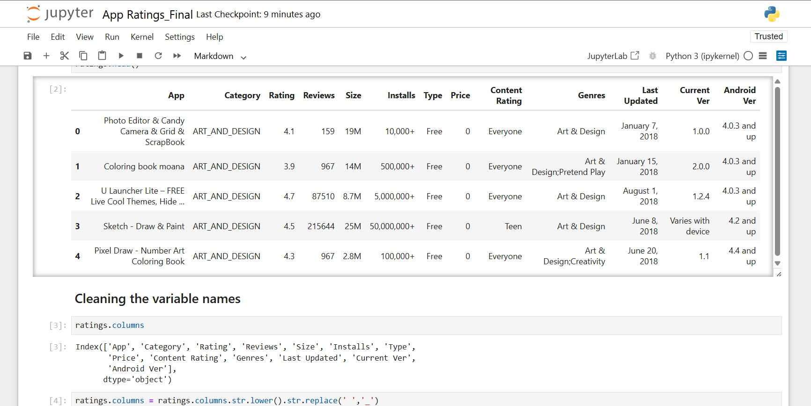
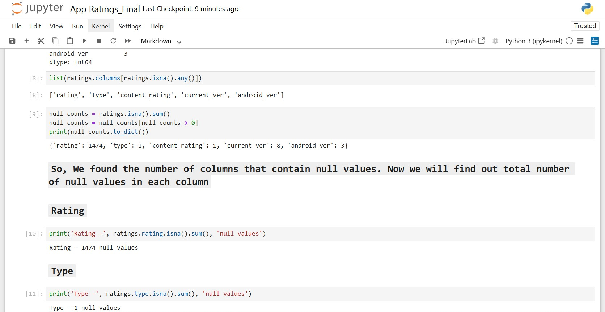
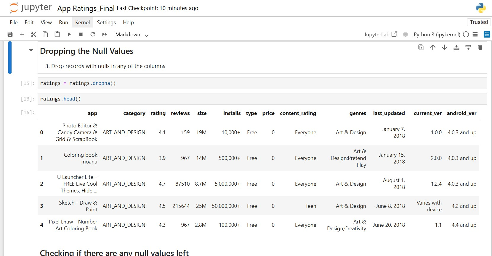
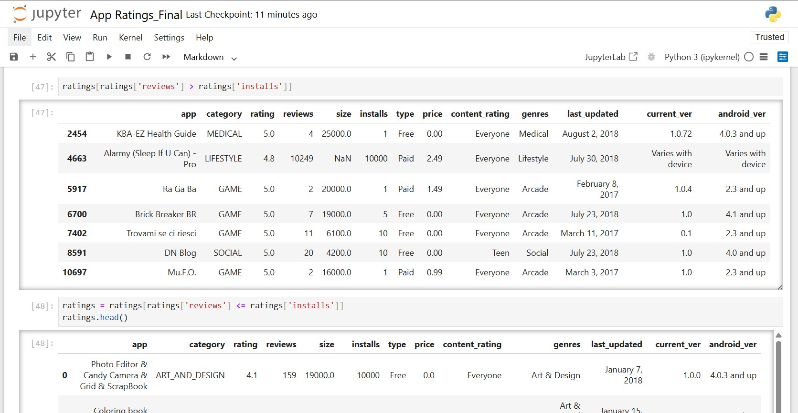
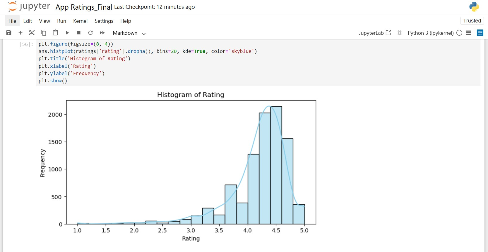
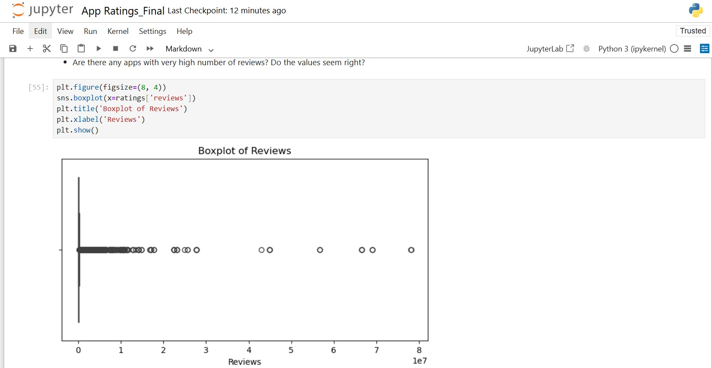
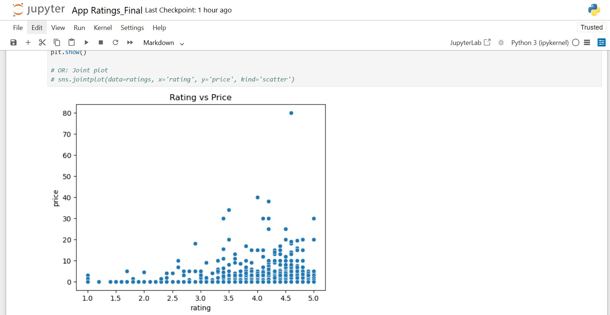
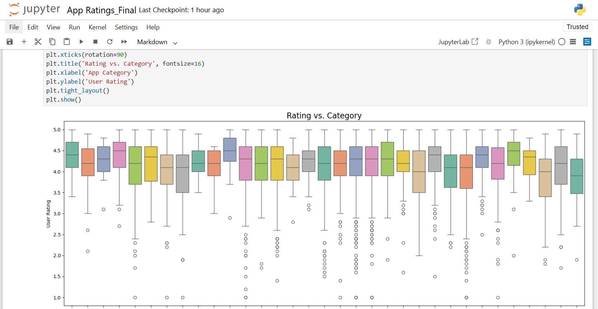

# 📱 Google Play Store App Rating Analysis

## 📌 Project Overview
- This project focuses on analyzing Google Play Store data to understand the factors influencing **app ratings**.
- The goal is to identify patterns that can help Google boost visibility for promising apps in search results and recommendations.

---

## 🎯 Problem Statement
- The Google Play Store team is introducing a feature to **promote high-potential apps** by improving their visibility in search results and recommendations.
- To ensure this is effective, it’s essential to analyze historical app data to uncover the key drivers of high ratings.

---

## 🛠️ Tools Used

* **Python (Pandas, NumPy)** – for data preprocessing and cleaning
* **Matplotlib & Seaborn** – for exploratory data visualization

---

## 🔍 Approach & Analysis

### 1. 📋 Data Cleaning & Preprocessing

* **Loading Dataset**
  

* Checked for **null values** and dropped incomplete rows
  
  
  

* Fixed **data types** (e.g., reviews, installs, prices)

* Converted `Size` from KB/MB to numeric values

* Removed **symbols** and formatting from `Price` and `Installs`

* Applied **sanity checks**:
  * Ratings between 1 and 5 only
  * Reviews ≤ Installs
  * Free apps with price = 0

---

### 2. 📊 Exploratory Data Analysis (EDA)

#### ⭐ Ratings Distribution

Most apps tend to have ratings above 4

#### 📝 Reviews Outlier Analysis

Detected a small number of apps with extremely high reviews, skewing the distribution

#### 💲 Ratings vs Price

Scatterplot shows most high-rated apps are either free or moderately priced

#### 📂 Ratings vs Category

Boxplot reveals variation in ratings between different app categories

---

### 3. 🚫 Outlier Treatment

* Dropped apps with unrealistically high prices
* Removed apps with reviews > 2M
* Filtered out extreme installs counts based on percentile thresholds

---

## 🧠 Key Insights
* **Pricing extremes** are usually junk or irrelevant apps
* **High ratings** are common, but extreme review counts belong to top global apps that dominate the market
* App size does not have a direct correlation with rating but follows certain patterns in specific categories

---

> 📌 *Note: Dataset and source code are excluded to maintain project originality.*
